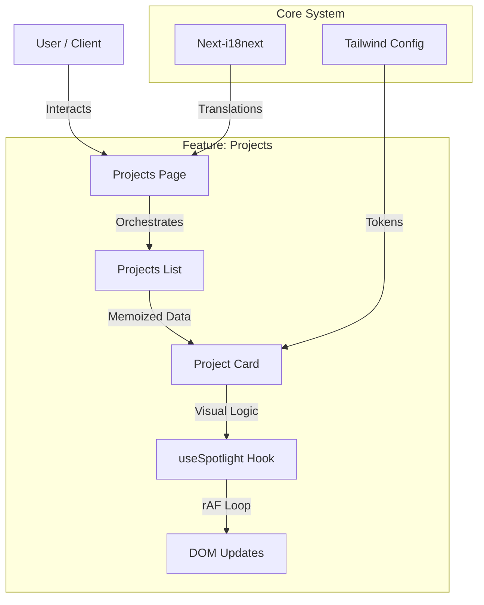

# 🚀 Portfolio - Senior Software Engineer

[](https://nextjs.org/)
[](https://www.typescriptlang.org/)
[](https://tailwindcss.com/)
[](LICENSE)
[](https://developers.google.com/web/tools/lighthouse)

## 📌 Project Narrative

This portfolio is more than a collection of work samples; it is a demonstration of **modern full-stack architecture** and **inclusive design principles**. 

As a Senior Software Engineer, I approached this project with the same rigor used in enterprise-grade applications. Every architectural decision—from the modular component structure to the specific animation libraries—was made to solve concrete engineering challenges regarding performance, maintainability, and user experience.

The result is a codebase that showcases:
- **Declarative Architecture**: A clean separation of concerns using domain-specific components.
- **Performance First**: Zero-layout-shift rendering and consistent 60fps animations via `requestAnimationFrame`.
- **Accessibility as Standard**: Deep ARIA integration and `prefers-reduced-motion` support deeply woven into the interaction model.

---

## 🛠️ Technology Stack & Rationale

We selected a stack that balances developer experience with production performance.

| Category | Technology | Rationale |
|----------|------------|-----------|
| **Core Framework** | **Next.js 14 (App Router)** | Leverages React Server Components to minimize client-side bundle size and improve SEO. |
| **Language** | **TypeScript 5** | Ensures type safety and facilitates large-scale refactoring with confidence. |
| **Styling** | **Tailwind CSS** | Provides a constrained design system token set for visual consistency and rapid iteration. |
| **Animations** | **Framer Motion** | Handles complex, physics-based interactions (springs, layout transitions) that CSS alone cannot express comfortably. |
| **Internationalization** | **next-i18next** | Robust standard for managing multilingual content without hydration mismatches. |
| **CI/CD** | **Vercel** | Seamless preview deployments and edge caching strategy. |

---

## 🏗️ Architecture Overview

The codebase follows a **Feature-Driven Architecture** within the Next.js App Router structure, prioritizing modularity and separation of concerns.

### High-Level Data Flow



### Key Directories
- `src/app`: Application routes and layouts (Server Components by default).
- `src/components`: Reusable UI components organized by domain feature.
  - `projects/`: Specialized components for the Projects section (`ProjectCard`, `TechBadge`).
- `src/styles`: Global styles and Tailwind configuration.

---

## ⚡ Performance & Optimization

We employ a multi-layered strategy to ensure optimal performance metrics (Lighthouse 95+).

### 1. Rendering Optimization
- **Server Components**: We utilize React Server Components (RSC) to reduce the client-side JavaScript bundle, hydrating only interactive simple leaves (like cards).
- **Memoization**: Heavy components use `React.memo` and strictly memoized props to prevent unnecessary re-renders during parent updates.

### 2. Interaction Performance
- **requestAnimationFrame**: High-frequency events (like mouse tracking) bypass React state for direct DOM manipulation references where possible, or use throttled updates synced with the browser paint cycle.
- **Hardware Acceleration**: Animations utilize CSS `transform` and `opacity` properties to trigger GPU compositing layers, avoiding layout thrashing.

### 3. Image Strategy
- **Next.js Image**: Automatic format optimization (WebP/AVIF) and size generation.
- **Lazy Loading**: Images below the fold are loaded lazily; critical LCP images invoke `priority`.

---

## ✨ Features

### User Experience
- **Premium Design**: Glassmorphism aesthetic with refined micro-interactions and "weighty" physics.
- **Responsive & Adaptive**: "Spotlight" effect on desktop transforms into "Active Glow" on mobile to match input paradigms.
- **Multilingual**: Instant language switching preserving route state.

### Technical Highlights
- **Optimized Spotlight**: Custom hooks using `rAF` to track cursor position without triggering React render cycles.
- **Modular Component Architecture**: specialized subcomponents (e.g., `src/components/projects/`) for maintainability.
- **Dynamic OG Images**: Automated social media preview generation.

---

## 🚀 Getting Started

Follow these instructions to set up the project locally for development or inspection.

### Prerequisites
- **Node.js**: Version 18.17 or higher.
- **Package Manager**: npm, pnpm, or yarn.

### Installation

1. **Clone the repository**
   ```bash
   git clone https://github.com/juliandeveloper05/mi-portfolio-2024.git
   cd mi-portfolio-2024
   ```

2. **Install dependencies**
   ```bash
   npm install
   # or
   pnpm install
   ```

3. **Start the development server**
   ```bash
   npm run dev
   ```

4. **View the application**
   Open [http://localhost:3000](http://localhost:3000) in your browser.

### Troubleshooting
- **Hydration Errors**: If you see hydration warnings related to extensions, ensure you view the page in Incognito mode or disable browser extensions.
- **Node Version**: If the build fails, verify you are using Node v18+ by running `node -v`.

---

## 🤝 Contribution Guidelines

This project maintains professional standards for collaboration. While primarily a personal portfolio, we welcome architectural improvements and bug fixes.

### Code Style
- **TypeScript Strict Mode**: No `any`. Use interfaces for all prop definitions.
- **Component Colocation**: Keep related logic, types, and sub-components within the same feature directory.

### Commit Convention
We follow **Conventional Commits**:
- `feat:` New features
- `fix:` Bug fixes
- `docs:` Documentation changes
- `chore:` Maintenance tasks

### Pull Request Process
1. Fork the repository
2. Create your feature branch (`git checkout -b feat/amazing-feature`)
3. Commit your changes
4. Push to the branch
5. Open a Pull Request

---

## 🚀 Deployment

The project is optimized for deployment on [Vercel](https://vercel.com), the creators of Next.js.

### Pipeline
1. **Push to Main**: Commits to the `main` branch trigger a production build.
2. **Preview Deployments**: Pull Requests automatically generate a unique preview URL for QA.
3. **Edge Caching**: Static assets are automatically cached at the edge for global performance.

### Environment Variables
Production variables are managed securely in the Vercel Dashboard. Currently, no sensitive keys are required for the public build.

---

## 🗺️ Roadmap

We practice continuous improvement. Future enhancements currently planned:

- **Phase A (Q3 2024)**: System Theme Synchronization (Dark/Light mode preference).
- **Phase B (Q4 2024)**: Integration of a Headless CMS for easier blog/project updates.
- **Phase C (Q1 2025)**: End-to-End Testing Suite (Cypress/Playwright).
- **Phase D**: Automated Accessibility Regression Testing in CI.

---

## 📄 License

This project operates under a **Dual License** model:
- **Source Code**: MIT License (Open for study and adaptation).
- **Content & Assets**: Copyright © 2024 Julian Soto (Reserved).

See [LICENSE](LICENSE) for full details.
