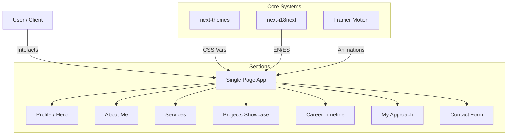

# 🚀 Portfolio - Senior Software Engineer

[](https://nextjs.org/)
[](https://www.typescriptlang.org/)
[](https://tailwindcss.com/)
[](https://www.framer.com/motion/)
[](https://www.i18next.com/)
[](LICENSE)
[](https://developers.google.com/web/tools/lighthouse)

## 📌 Project Narrative

This portfolio is more than a collection of work samples; it is a demonstration of **modern full-stack architecture** and **inclusive design principles**, designed to showcase my work to **clients and companies**.

As a Senior Software Engineer, I approached this project with the same rigor used in enterprise-grade applications. Every architectural decision—from the modular component structure to the specific animation libraries—was made to solve concrete engineering challenges regarding performance, maintainability, and user experience.

The result is a codebase that showcases:
- **Declarative Architecture**: A clean separation of concerns using domain-specific components.
- **Performance First**: Zero-layout-shift rendering and consistent 60fps animations via `requestAnimationFrame`.
- **Accessibility as Standard**: Deep ARIA integration and `prefers-reduced-motion` support deeply woven into the interaction model.
- **Bilingual Experience**: Full English/Spanish internationalization with seamless language switching.
- **Adaptive Theming**: Professional Dark/Light mode with smooth transitions and system preference detection.

---

## 🛠️ Technology Stack & Rationale

A carefully selected stack that balances developer experience with production performance.

| Category | Technology | Rationale |
|----------|------------|-----------|
| **Core Framework** | **Next.js 14** | Leverages React Server Components to minimize client-side bundle size and improve SEO. |
| **Language** | **TypeScript 5** | Ensures type safety and facilitates large-scale refactoring with confidence. |
| **Styling** | **Tailwind CSS 3.4** | Provides a constrained design system token set for visual consistency and rapid iteration. |
| **Animations** | **Framer Motion + GSAP** | Handles complex, physics-based interactions (springs, layout transitions) and timeline-based sequences. |
| **3D Effects** | **Three.js + React Three Fiber** | Powers the interactive canvas reveal effect in the Approach section. |
| **Internationalization** | **next-i18next** | Robust standard for managing multilingual content (EN/ES) without hydration mismatches. |
| **Theming** | **next-themes** | System-level Dark/Light mode synchronization with CSS custom properties. |
| **Contact** | **EmailJS** | Serverless email delivery for the contact form without backend infrastructure. |
| **CI/CD** | **Vercel** | Seamless preview deployments and edge caching strategy. |

---

## 🏗️ Architecture Overview

The codebase follows a **Feature-Driven Architecture** prioritizing modularity and separation of concerns.

### High-Level Data Flow


```mermaid
graph TD
    User[User / Client] -->|Interacts| Page[Single Page App]

    subgraph "Sections"
        Page --> Profile[Profile / Hero]
        Page --> About[About Me]
        Page --> Services[Services]
        Page --> Projects[Projects Showcase]
        Page --> Timeline[Career Timeline]
        Page --> Approach[My Approach]
        Page --> Contact[Contact Form]
    end

    subgraph "Core Systems"
        Theme[next-themes] -->|CSS Vars| Page
        I18n[next-i18next] -->|EN/ES| Page
        Anim[Framer Motion] -->|Animations| Page
    end
```

### Key Directories
- `src/pages`: Application routes and layouts.
- `src/components`: 30+ reusable UI components organized by domain feature.
  - `projects/`: Specialized components (`ProjectCard`, `TechBadge`, `SpotlightEffect`, `useSpotlight`).
  - `ui/`: Visual effect components (`canvas-reveal-effect`).
  - `core/`: Layout primitives (`ConstrainedBox`, `ResponsiveBox`).
  - `magicui/`: Text animation components (`letter-pullup`).
- `src/styles`: Global styles, CSS custom properties, and Tailwind configuration.
- `public/locales`: Translation files (EN/ES) organized by section namespace.

---

## ⚡ Performance & Optimization

Multi-layered strategy to ensure optimal performance metrics (Lighthouse 95+).

### 1. Rendering Optimization
- **Server-Side Rendering**: SSR with `getStaticProps` for i18n translations and optimal SEO.
- **Memoization**: Heavy components use `React.memo` and strictly memoized props to prevent unnecessary re-renders.
- **Dynamic Imports**: Client-only components (cursor, water wave) loaded dynamically to avoid SSR issues.

### 2. Interaction Performance
- **requestAnimationFrame**: High-frequency events (mouse tracking for spotlight) bypass React state for direct DOM manipulation.
- **Hardware Acceleration**: Animations use CSS `transform` and `opacity` to trigger GPU compositing layers.
- **Intersection Observer**: Scroll-triggered animations only activate when elements enter the viewport.

### 3. Image Strategy
- **Next.js Image**: Automatic format optimization (WebP/AVIF) and responsive size generation.
- **Lazy Loading**: Images below the fold loaded lazily; critical LCP images use `priority`.

---

## ✨ Features

### Portfolio Sections
- **Profile / Hero**: Dynamic introduction with name, tagline, CTA buttons, CV download, and social links.
- **About Me**: Professional biography, experience statistics, and comprehensive tech stack (Frontend, Backend, AI/ML, Architecture).
- **Services**: 6 service cards — Frontend, Backend, Database, Full-Stack, CMS Development, and AI & Audio.
- **Projects Showcase**: 6 featured projects with live demos, GitHub repos, tech stacks, and interactive spotlight effect.
- **Career Timeline**: Interactive expandable timeline with career milestones and education.
- **My Approach**: 3-step methodology cards with Three.js canvas reveal animation on hover.
- **Contact Form**: Functional email form powered by EmailJS with validation and toast notifications.

### User Experience
- **Dark/Light Mode**: Professional theme system with CSS custom properties, smooth transitions, and system preference detection.
- **Bilingual (EN/ES)**: Complete internationalization with 11 translation namespaces per language and instant switching.
- **Premium Design**: Glassmorphism aesthetic with grain texture overlay and refined micro-interactions.
- **Responsive & Adaptive**: Spotlight effect on desktop, touch-optimized glow on mobile.
- **Custom Cursor**: Animated cursor with magnetic interaction wrappers (desktop only).
- **Smooth Scrolling**: react-scroll navigation with scroll-reveal entrance animations.

### Technical Highlights
- **Optimized Spotlight**: Custom `useSpotlight` hook using `rAF` to track cursor without triggering React render cycles.
- **Canvas Reveal Effect**: Three.js dot matrix animation with React Three Fiber integration.
- **CSS Custom Properties Theming**: 15+ CSS variables that cascade across all components for consistent theming.
- **Modular Component Architecture**: 30+ specialized components organized by feature domain.
- **Scroll-Triggered Animations**: Intersection Observer-based reveal animations for all sections.

---

## 🚀 Getting Started

Follow these instructions to set up the project locally for development or inspection.

### Prerequisites
- **Node.js**: Version 18.17 or higher.
- **Package Manager**: npm, pnpm, or yarn.

### Installation

1. **Clone the repository**
   ```bash
   git clone https://github.com/juliandeveloper05/mi-portfolio-2024.git
   cd mi-portfolio-2024
   ```

2. **Install dependencies**
   ```bash
   npm install
   # or
   pnpm install
   ```

3. **Start the development server**
   ```bash
   npm run dev
   ```

4. **View the application**
   Open [http://localhost:3000](http://localhost:3000) in your browser.

### Environment Variables
For the contact form to work, configure these in a `.env.local` file:
```
NEXT_PUBLIC_EMAILJS_SERVICE_ID=your_service_id
NEXT_PUBLIC_EMAILJS_TEMPLATE_ID=your_template_id
NEXT_PUBLIC_EMAILJS_USER_ID=your_user_id
```

### Troubleshooting
- **Hydration Errors**: If you see hydration warnings related to extensions, view in Incognito mode or disable browser extensions.
- **Node Version**: Verify Node v18+ with `node -v`.

---

## 🤝 Contribution Guidelines

This project maintains professional standards for collaboration. While primarily a personal portfolio, architectural improvements and bug fixes are welcome.

### Code Style
- **TypeScript Strict Mode**: No `any`. Use interfaces for all prop definitions.
- **Component Colocation**: Keep related logic, types, and sub-components within the same feature directory.

### Commit Convention
We follow **Conventional Commits**:
- `feat:` New features
- `fix:` Bug fixes
- `docs:` Documentation changes
- `chore:` Maintenance tasks

### Pull Request Process
1. Fork the repository
2. Create your feature branch (`git checkout -b feat/amazing-feature`)
3. Commit your changes
4. Push to the branch
5. Open a Pull Request

---

## 🚀 Deployment

The project is optimized for deployment on [Vercel](https://vercel.com), the creators of Next.js.

### Pipeline
1. **Push to Main**: Commits to the `main` branch trigger a production build.
2. **Preview Deployments**: Pull Requests automatically generate a unique preview URL for QA.
3. **Edge Caching**: Static assets are automatically cached at the edge for global performance.

### Environment Variables
Production variables (EmailJS keys) are managed securely in the Vercel Dashboard.

---

## 🗺️ Roadmap

### Completed

- ~~**Phase A (Q3 2024)**: System Theme Synchronization (Dark/Light mode preference).~~ — Implemented with `next-themes`, CSS custom properties, and smooth transitions.
- ~~**Phase B (Q4 2024)**: Bilingual Support (English/Spanish).~~ — Full i18n with `next-i18next`, 11 namespaces per language.
- ~~**Phase C (Q4 2024)**: Contact Form Integration.~~ — EmailJS-powered contact form with validation and toast notifications.
- ~~**Phase D (Q4 2024)**: Interactive Animations & Visual Effects.~~ — Framer Motion, GSAP, Three.js canvas reveal, custom cursor, spotlight effect, scroll reveals.
- ~~**Phase E (Q1 2025)**: Services & Career Timeline Sections.~~ — 6 service cards and interactive expandable timeline.
- ~~**Phase F (Q1 2025)**: Premium Design System.~~ — Glassmorphism, grain texture, CSS custom properties theming, responsive typography with `clamp()`.

### Next Steps

- **Phase G**: End-to-End Testing Suite (Cypress or Playwright) for all portfolio sections.
- **Phase H**: Automated Accessibility Regression Testing in CI (axe-core + Lighthouse CI).
- **Phase I**: Client Testimonials Section — Carousel with real client reviews and ratings to build trust.
- **Phase J**: Case Studies Page — Detailed project breakdowns showing process, challenges, solutions, and results (replaces the need for a blog).
- **Phase K**: Analytics Dashboard Integration — Track visitor engagement, popular projects, and contact form conversion rates.
- **Phase L**: PDF Resume Generator — Auto-generate a downloadable PDF resume from portfolio data.
- **Phase M**: Project Filtering & Search — Allow visitors to filter projects by technology, category, or industry.
- **Phase N**: Performance Monitoring — Integrate Web Vitals tracking and automated Lighthouse CI scores per deploy.
- **Phase O**: Micro-Animations Polish — Loading skeleton screens, page transition animations, and staggered content reveals.

---

## 📄 License

This project operates under a **Dual License** model:
- **Source Code**: MIT License (Open for study and adaptation).
- **Content & Assets**: Copyright © 2024 Julian Soto (Reserved).

See [LICENSE](LICENSE) for full details.
